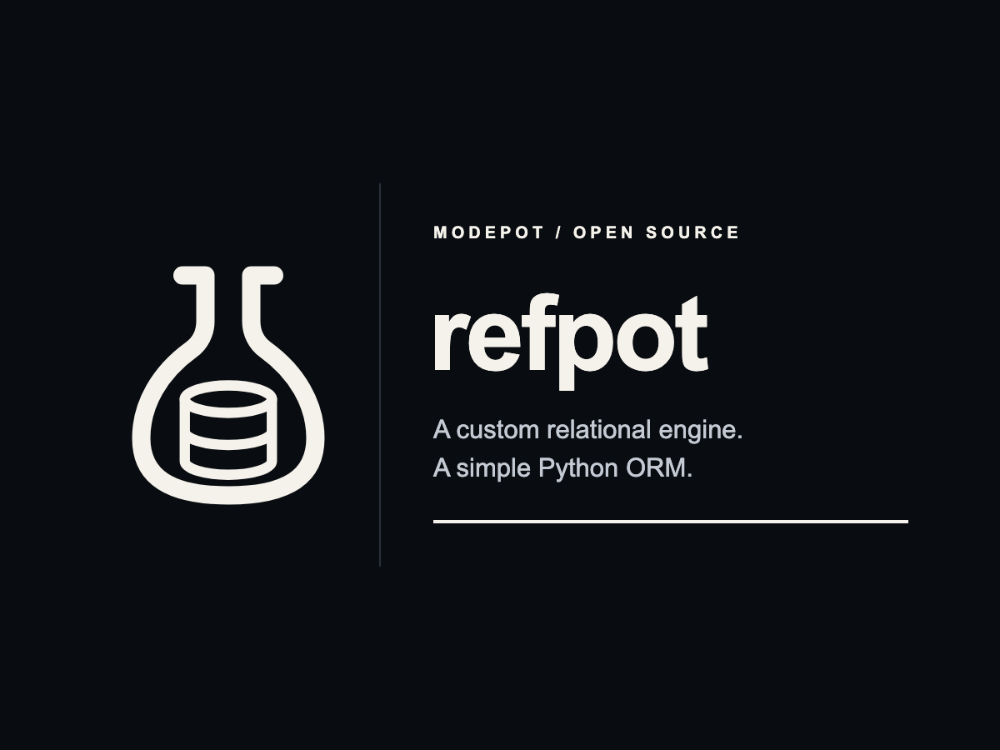
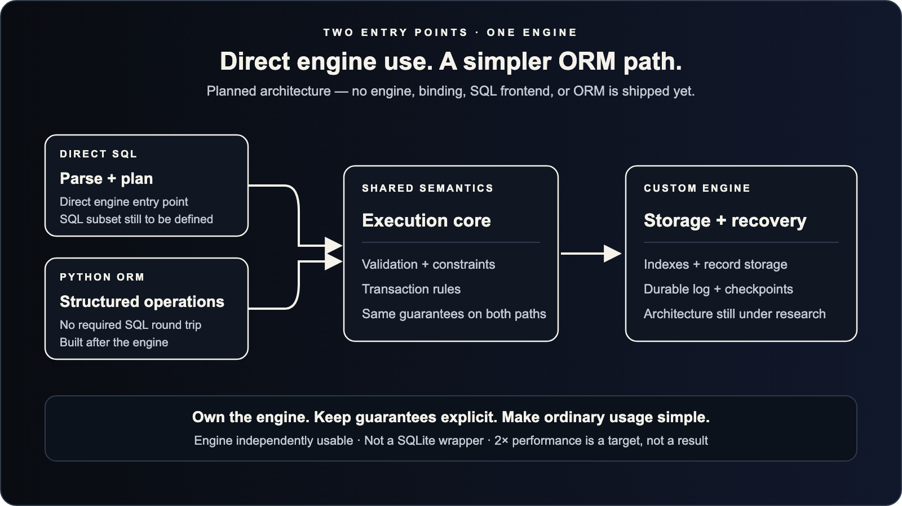
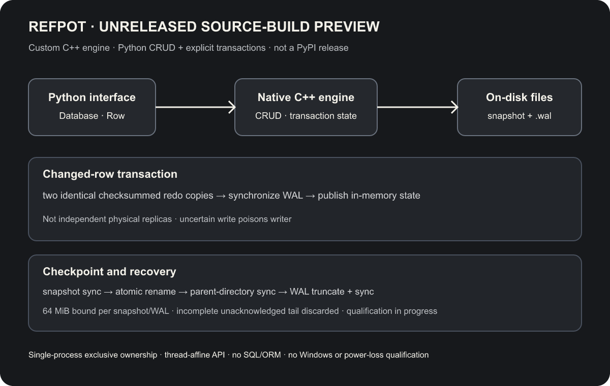
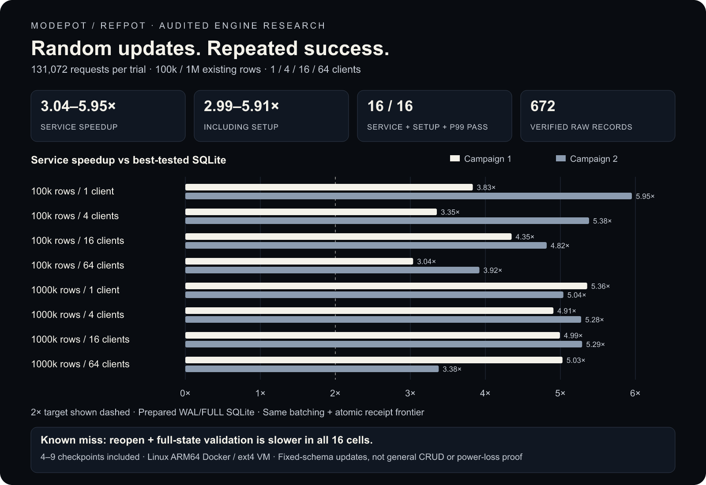

# refpot

<p align="center">
  
</p>

<p align="center">Part of <a href="https://modepot.io/">ModePot</a>. &nbsp; <a href="https://refpot.modepot.io/">Project website</a> &nbsp; <a href="https://tugrul.modepot.io/">Created by Tugrul Guner</a></p>

<p align="center">
  <strong>A custom embedded database preview for Python.</strong>
</p>

<p align="center">
  RefPot is an unreleased native C++ redo-and-checkpoint engine with Python CRUD and explicit transactions. Build the preview from source; it is not published on PyPI or qualified for production use.
</p>

<p align="center">
  <a href="https://github.com/tugrulguner/refpot/actions/workflows/ci.yml"></a>
  
  
  <a href="https://github.com/tugrulguner/refpot/blob/main/LICENSE"></a>
  <a href="https://discord.gg/u3AANZr6RG"></a>
  <a href="https://github.com/tugrulguner/refpot"></a>
</p>

<p align="center">
  <a href="#quick-start">Quick start</a> ·
  <a href="#why-refpot">Why RefPot</a> ·
  <a href="#package-contract">Package contract</a> ·
  <a href="https://refpot.modepot.io/">Documentation</a> ·
  <a href="https://refpot.modepot.io/package-contract/">Deep reference</a> ·
  <a href="#examples">Examples</a> ·
  <a href="#community">Community</a> ·
  <a href="#contributing">Contributing</a>
</p>

<p align="center">
  
</p>

> [!IMPORTANT]
> This repository contains an unreleased local source-build preview, not a PyPI release or supported distribution. Package and platform qualification remain in progress. There is no general performance claim or production durability guarantee.

## Why RefPot

RefPot is an early custom embedded database engine: a native C++ redo-and-checkpoint core exposed through a small Python `Database` / `Row` API. The package preview already supports fixed-schema CRUD and explicit transactions; it is not merely a research design. SQL and ORM are future design direction, not shipped interfaces.

## Quick start

Requires Python 3.11–3.14 and a C++17 toolchain. From the repository root, build and install the unreleased source preview, then run the complete inline example:

```sh
uv pip install .
python - <<'PY'
from pathlib import Path
from tempfile import TemporaryDirectory

from refpot import Database, Row

with TemporaryDirectory(prefix="refpot-quickstart-") as directory:
    path = Path(directory) / "example.rp"  # The parent directory must exist.
    with Database(path) as db:
        db.insert(1, 42, "answer")
        db.update(1, value=43)
        assert db.get(1) == Row(1, 43, "answer")
        with db.transaction():
            db.insert(2, 99)
        try:
            with db.transaction():
                db.update(1, value=100)
                raise RuntimeError("roll back this transaction")
        except RuntimeError:
            pass
        assert db.get(1) == Row(1, 43, "answer")
        db.delete(2)
    with Database(path) as db:
        assert db.get(1) == Row(1, 43, "answer")
        print(db.get(1))
PY
```

The example demonstrates CRUD, transaction commit and rollback, and persisted state after close/reopen. No output is prescribed here; run it to see the actual `Row` representation. This is a local source build, not a released install path. Also run the shipped [CRUD example](examples/crud.py) and [transaction example](examples/transactions.py).

## Package contract

The database starts empty. Keys and integer values are signed 64-bit integers; text is UTF-8 limited to 31 encoded bytes. The database path names a **file, not a directory**, and its parent directory must already exist. One process exclusively owns each database; only its creating thread may use the handle.

The native engine uses versioned snapshots and a WAL. Snapshot and WAL recovery are each bounded to 64 MiB. Incomplete unacknowledged tails are discarded; complete transactions with both copies corrupt are rejected; uncertain writes poison the writer. These implementation details are not broad recovery qualification or a physical power-loss guarantee. Concurrent readers, multiwriter use, Windows, existing-format compatibility, SQL and ORM are unsupported. See the full [package contract](docs/package-contract.md) and [package recommendation](docs/package-recommendation.md).

## Current package architecture

<p align="center"><a href="docs/assets/refpot-package.svg"></a></p>

[Open the full-size editable SVG](docs/assets/refpot-package.svg) · [Detailed package contract](docs/package-contract.md)

Mutation and diff-scan paths copy maps; package performance is unqualified and this preview is not presented as benchmark-fast.

## Examples

The standalone [CRUD example](examples/crud.py) exercises insert, update, delete, context-managed close, and reopen. The [transaction example](examples/transactions.py) demonstrates read-your-writes, commit, rollback, checkpoint, and reopen. Run them after installation:

```sh
python examples/crud.py
python examples/transactions.py
```

The full task-first docs live at [RefPot documentation](https://refpot.modepot.io/) with [package quick start](https://refpot.modepot.io/package/), [package reference](https://refpot.modepot.io/package-contract/), [status and next steps](https://refpot.modepot.io/status/), and [design direction](https://refpot.modepot.io/design/).

## Retained benchmark findings

<p align="center"></p>

[Detailed findings, raw evidence and reproduction](benchmarks/random-updates/README.md) ·
[Full-size chart](docs/assets/refpot-benchmark.png) ·
[Next package recommendation](docs/package-recommendation.md)

The experimental findings are separate from package performance. The 3.04–5.95× result applies only to the historical update harness; it is not a package claim. The historical reopen result remains 16/16 losses. No performance ratio is asserted for this package.

## Planned design direction

The preserved [planned architecture visual above](#refpot) shows a future SQL/ORM direction, not this preview. Neither SQL nor ORM is implemented.

- **Engine first.** Establish correctness and performance before building the ORM.
- **One semantic boundary.** Direct operations must not bypass validation or constraints.
- **Explicit guarantees.** Internal plan selection must not silently weaken durability,
  isolation, transaction boundaries, or result semantics.
- **Bounded maintenance.** Include checkpointing, reclamation, and recovery debt in design
  and measurement, rather than hiding them outside favorable timings.
- **Simple public usage.** Keep storage layout, encoding, and routing choices private
  unless a user genuinely needs an operational control.

Language, storage format, index structure, isolation model, and SQL compatibility scope
remain decisions to earn through coherent experiments. A native-language rewrite alone
is not a differentiator. No SQLite SQL, file-format, or C API compatibility is promised.

## Performance target

**At least 2× improvement over SQLite is an acceptance target, not an achieved package guarantee.**

Before claiming it, define and publish a workload matrix, then retain every passing and
failing cell. Compare equivalent operations, returned values, transaction boundaries,
constraints, and durability acknowledgments against prepared SQLite and its best-tested
configuration for each workload. Package performance remains unqualified.

## Community

Join the [ModePot Discord](https://discord.gg/u3AANZr6RG) for design discussions,
implementation questions, early ideas, and database use cases across the family.
Use [GitHub Issues](https://github.com/tugrulguner/refpot/issues) for scoped proposals
and reproducible findings. The source-build preview is unreleased and not yet broadly qualified.

## Contributing

See [CONTRIBUTING.md](CONTRIBUTING.md) for setup and contribution workflow. The first useful work is helping define a small, testable engine contract and qualification
matrix. Correctness cases, crash and I/O-failure scenarios, reproducible benchmark methods,
and low-ceremony usage designs are more useful now than a broad speculative API.

Discuss substantial architecture or public-contract changes in
[GitHub Issues](https://github.com/tugrulguner/refpot/issues) before implementing them.
Do not introduce a SQLite wrapper as the engine, publish invented benchmark output, or
present research prototypes as production capabilities.

The logo source is [SVG](docs/assets/refpot-lockup.svg); the README uses its
[PNG rendering](docs/assets/refpot-lockup.png).

## License

RefPot is distributed under the [MIT License](LICENSE).

See [CHANGELOG.md](CHANGELOG.md) for changes and [release guidance](docs/releasing.md) for release policy.
